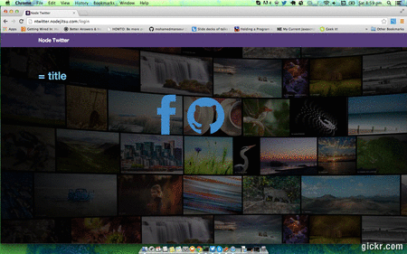

# Node Twitter

This project is an attempt to build a twitter clone in node.


### Installation instruction

- Install node  and npm here (http://nodejs.org)
- Install mongodb (http://docs.mongodb.org/manual/installation/)

When you have these installed, clone the project:

```bash
$ git clone git@github.com:vinitkumar/node-twitter.git
$ cd node-twitter
$ npm install
```
By above step you will get all required libraries and node modules. 
Once done, go to these links:

- [Facebook Developer](http://developer.facebook.com)
- [Github Developer](https://github.com/settings/applications)

and create your own apps on these platform, since the applications uses these two for login.
Once you have entered the application app id and secret. Just do 

```bash
$ npm start
```
This will run the app on [http://localhost:3000](http://localhost:3000)

## Contributions:

If you want to contribute, here are some advices:
- Use proper git flow.
- Follow the style guide.
- Create issue about what you want to add or report a bug.

## Author

Vinit Kumar, @vinitkumar (Github) , @vinitkme (Twitter)

[](https://bitdeli.com/free "Bitdeli Badge")

=======

Developer Certificate of Origin
Version 1.1

Copyright (C) 2004, 2006 The Linux Foundation and its contributors.
660 York Street, Suite 102,
San Francisco, CA 94110 USA

Everyone is permitted to copy and distribute verbatim copies of this
license document, but changing it is not allowed.


Developer's Certificate of Origin 1.1

By making a contribution to this project, I certify that:

(a) The contribution was created in whole or in part by me and I
    have the right to submit it under the open source license
    indicated in the file; or

(b) The contribution is based upon previous work that, to the best
    of my knowledge, is covered under an appropriate open source
    license and I have the right under that license to submit that
    work with modifications, whether created in whole or in part
    by me, under the same open source license (unless I am
    permitted to submit under a different license), as indicated
    in the file; or

(c) The contribution was provided directly to me by some other
    person who certified (a), (b) or (c) and I have not modified
    it.

(d) I understand and agree that this project and the contribution
    are public and that a record of the contribution (including all
    personal information I submit with it, including my sign-off) is
    maintained indefinitely and may be redistributed consistent with
    this project or the open source license(s) involved.

